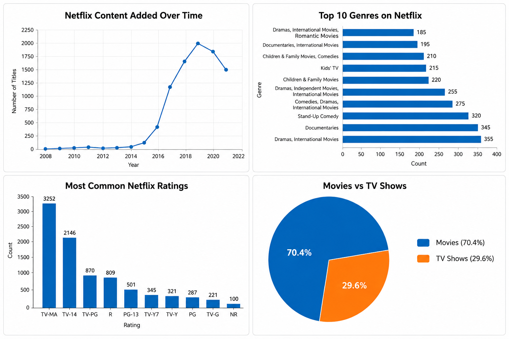

# Netflix-Data-Analysis
Exploratory data analysis of 8,800+ Netflix titles using Python, Pandas, and Matplotlib.

## Overview
I worked on this project to practice data cleaning, exploratory data analysis (EDA), and data visualization using Python.
The dataset contains information about Netflix movies and TV shows, including content type, ratings, genres, countries, and release years. The goal was to explore the dataset and identify trends in Netflix's content library.

## Tools Used
- Python
- Pandas
- Matplotlib
- Jupyter Notebook
- 
## Dashboard Preview
The image below combines the main visualizations created during the analysis:
- Netflix Content Added Over Time
- Top 10 Genres on Netflix
- Most Common Netflix Ratings
- Movies vs TV Shows Distribution

## Questions Explored
- How has Netflix content grown over time?
- What are the most common genres on Netflix?
- Which ratings appear most frequently?
- What is the distribution of Movies vs TV Shows?

## Key Findings
- Movies account for a larger share of Netflix content than TV Shows.
- TV-MA is the most common rating in the dataset.
- Netflix content grew rapidly between 2016 and 2020.
- Drama and International Movies are among the most common genres.

## Files Included
- netflix_analysis.ipynb
- netflix_titles.csv
- netflix-data-analytics-dashboard.png

## Skills Practiced
- Data Cleaning
- Exploratory Data Analysis
- Data Visualization
- Pandas
- Matplotlib
- Data Interpretation

